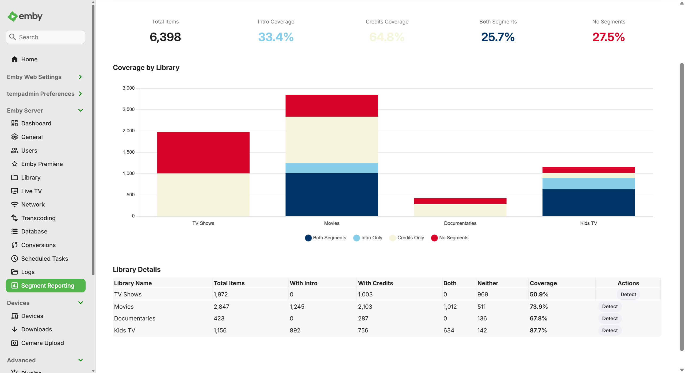
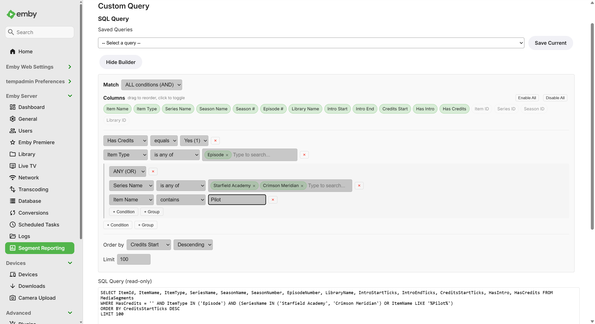

# Segment Reporting

An Emby server plugin for reporting, browsing, and editing media segment markers (Intros, Credits) across your libraries.

## Features

### Reporting & Navigation

- **Interactive Dashboard** — Overview charts showing segment coverage per library, with breadcrumb drill-down navigation into libraries, series, and episodes
- **Library Browsing** — Browse series and movies with segment coverage stats, sortable columns, and filtering by segment status (missing intros, missing credits, has intro, has credits, etc.)
- **Series Detail** — Season/episode grid with per-season intro and credits coverage percentages, expandable accordions, and search
- **Movie Support** — Movie libraries display a flat table with inline segment timestamps; mixed libraries show both series and movies. Note: there is currently no automated detection mechanism for movie intros or credits, so movie and mixed library support is primarily reporting-only unless you add markers manually

### Editing & Bulk Operations

- **Inline Editing** — Edit intro/credits timestamps directly in any table view (library, series, or query results)
- **Bulk Operations** — Copy segments across episodes, bulk delete intros or credits, and set credits-to-end in bulk
- **EmbyCredits Integration** — When the [EmbyCredits](https://github.com/faush01/EmbyCredits) plugin is installed, "Detect Credits" buttons appear on the dashboard, library, series, and custom query pages to trigger credits detection directly

### Custom Query

- **Visual Query Builder** — Point-and-click query builder with field/operator selection, condition groups, and drag-to-reorder column pills
- **Autocomplete & Multi-Value Selection** — Fields like Series Name, Library Name, and Item Type offer autocomplete suggestions from your library; use "is any of" / "is none of" operators for multi-value pill selection with `IN`/`NOT IN` SQL generation
- **Interactive Results** — Query results support inline editing, row selection with checkboxes, bulk actions, clickable playback links on timestamps, and CSV export
- **Saved Queries** — Save, load, and delete named queries; the visual builder fully round-trips `IN`/`NOT IN` clauses

### Settings & Maintenance

- **Display Preferences** — Choose from six chart color palettes or define custom colors, toggle gridlines and alternating row colors, and hide specific libraries from the dashboard
- **Scheduled Sync** — Automatic daily sync with your Emby server (configurable via Emby's Scheduled Tasks)
- **Cache Maintenance** — Weekly VACUUM task, on-demand Vacuum button, force rescan, and sync status display
- **About Page** — Plugin version, acknowledgements, Emby Forums link, and API endpoint reference

## Screenshots





See the **[User Guide](docs/USER_GUIDE.md)** for a full walkthrough with all screenshots.

## Installation

1. Download the latest release from the [GitHub Releases](../../releases) page
2. Copy the DLL file to your Emby server's plugins directory:
   - **Windows:** `C:\ProgramData\Emby-Server\plugins`
   - **Linux:** `/opt/emby-server/plugins` (or wherever your installation is)
3. Restart your Emby server
4. Navigate to **Settings → Plugins** and enable "Segment Reporting"
5. Run the initial sync via **Settings → Scheduled Tasks → Segment Reporting → Run Sync Segments Now**

## Configuration

The plugin integrates with Emby's built-in Scheduled Tasks system:

- **Sync Segments** — Default: Daily at 2:00 AM (crawls all libraries and syncs segment data to the cache)
- **Clean Segment DB** — Default: Weekly on Sunday at 3:00 AM (VACUUM and health check)

From the plugin Settings page you can:

- Choose a chart color palette (six presets or custom colors) with a live preview chart
- Toggle table gridlines and alternating row colors
- Hide specific libraries from the dashboard (per-library checkboxes)
- View cache statistics (row count, database size, last sync time)
- Force a full rescan or vacuum the database on demand

## Building from Source

### Prerequisites

- .NET SDK (any modern version such as .NET 6, 7, or 8 to compile the project)
- The project compiles to `.NET Standard 2.0` for compatibility with Emby Server

### Build

```bash
cd segment_reporting
dotnet restore
dotnet build --configuration Release
```

The compiled DLL will be in `bin/Release/`.

### Dependencies

- `mediabrowser.server.core` (4.8.x) — Emby server SDK
- `SQLitePCL.pretty.core` (1.2.2) — SQLite database wrapper
- `System.Memory` (4.5.5) — Memory utilities

## Supported Segment Types

- `IntroStart` — Intro marker start timestamp
- `IntroEnd` — Intro marker end timestamp
- `CreditsStart` — Credits marker start timestamp

These are the three marker types that Emby currently supports. Other segment types such as recaps, previews, commercials, and mid/post-credit scenes are not supported by Emby's chapter system and therefore cannot be tracked by this plugin.

## Data Model

Segment Reporting maintains a lightweight SQLite cache (`segment_reporting.db`) alongside your Emby server. The cache is always synchronized with Emby's source-of-truth chapter system:

- **Reads:** Fast queries from the SQLite cache
- **Writes:** Written through to Emby first, then the cache is updated
- **Sync:** Scheduled task crawls your libraries and rebuilds the cache

The cache supports both TV episodes and movies across mixed libraries, with denormalized tables designed for custom SQL queries.

## License

This project is licensed under **GNU General Public License v3.0** (GPL-3.0). See [LICENSE](LICENSE) for details.

## Acknowledgements

Segment Reporting is built on architectural patterns and code references from the following GPL-3.0 licensed projects by [faush01](https://github.com/faush01):

- **[playback_reporting](https://github.com/faush01/playback_reporting)** — Emby plugin for media playback analytics. Used as the primary architectural template for:
  - Plugin scaffolding and configuration patterns
  - SQLite data layer and query patterns
  - REST API structure and authentication
  - Embedded web page patterns (data-controller, AMD modules)
  - Scheduled task registration and execution
  - Chart library integration and visualization patterns

- **[ChapterApi](https://github.com/faush01/ChapterApi)** — Emby plugin providing a reference implementation of Emby's media segment APIs. Used as the reference for:
  - `IItemRepository.GetChapters()` and `SaveChapters()` APIs
  - Chapter/marker type definitions (`MarkerType` enum, `ChapterInfo` model)
  - Write-through patterns for persisting chapters to Emby

Both projects are licensed under GPL-3.0 and have been instrumental in understanding Emby's plugin architecture and segment handling capabilities.

## Documentation

- **[User Guide](docs/USER_GUIDE.md)** — Full walkthrough with screenshots
- **[Developer Guide](docs/DEVELOPER.md)** — Architecture, data models, API specs

## Support

- **Emby Forums** — [Segment Reporting discussion thread](https://emby.media/community/index.php?/topic/146268-segment-reporting-plugin/)
- **GitHub** — [Issues and feature requests](../../issues)
