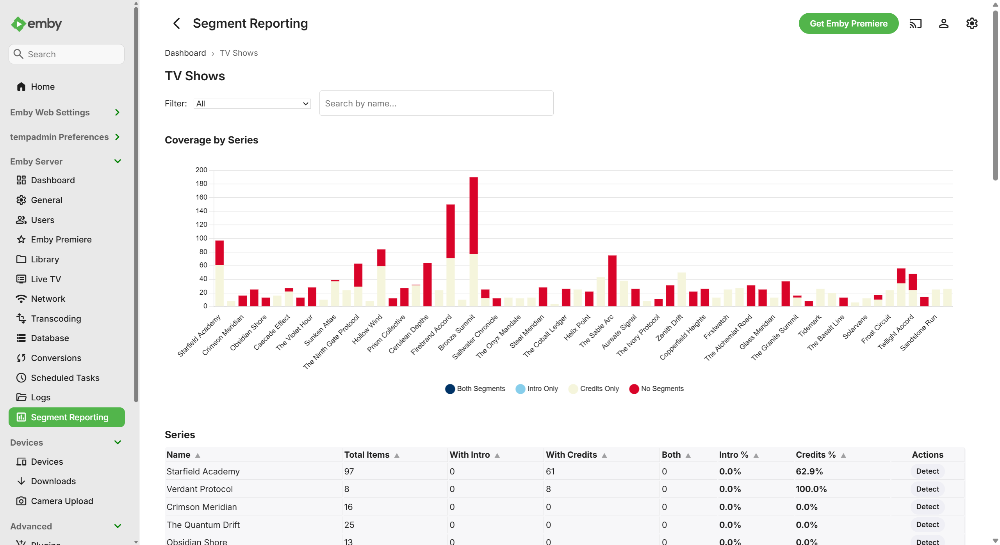
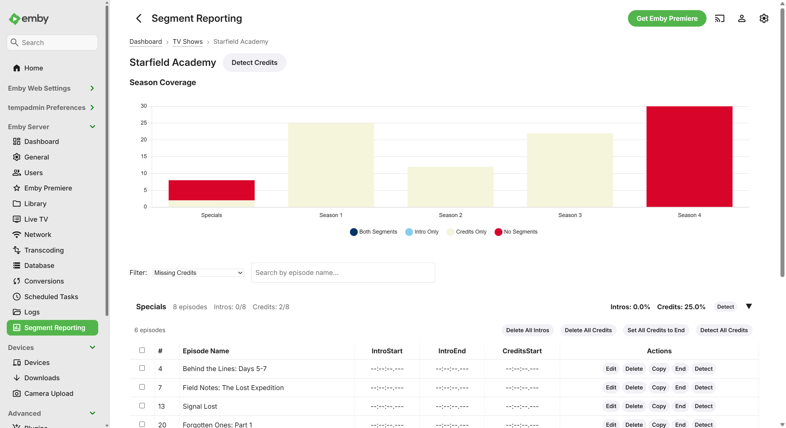
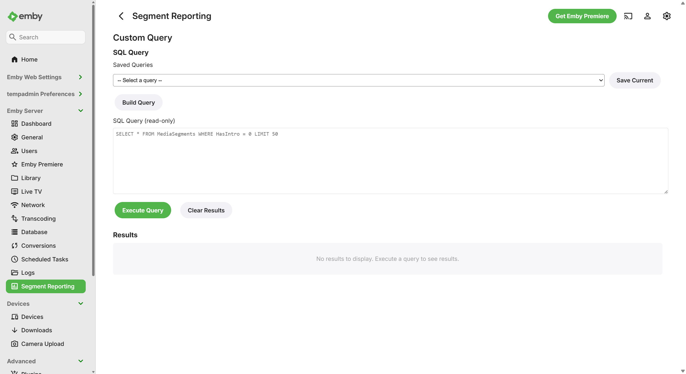
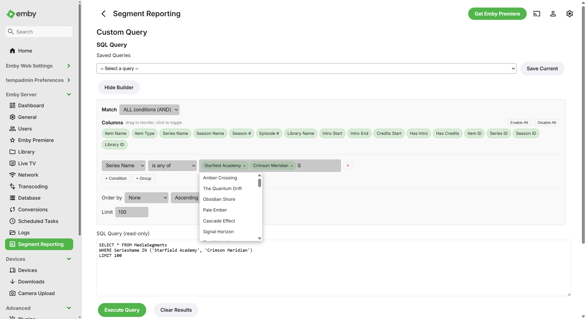
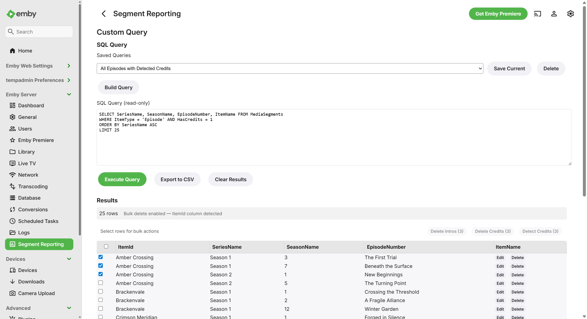
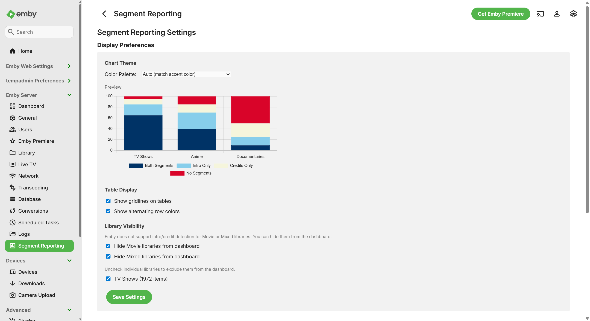
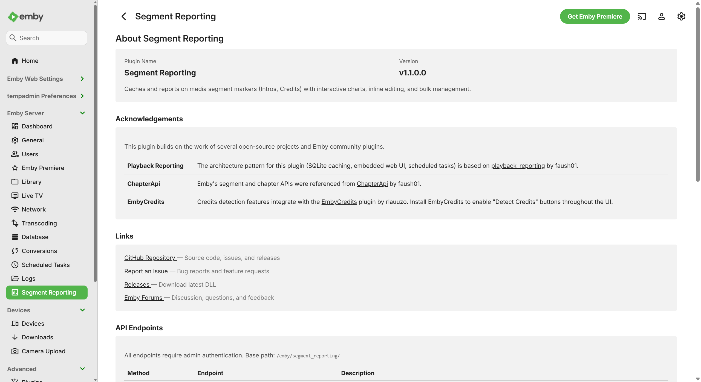

# Segment Reporting — User Guide

A complete walkthrough of the Segment Reporting plugin for Emby Server. This
guide covers installation, navigation, editing, bulk operations, custom queries,
and settings — everything you need to manage intro and credits markers across
your media libraries.

---

## Table of Contents

1. [Getting Started](#1-getting-started)
   - [What This Plugin Does](#what-this-plugin-does)
   - [Installation](#installation)
   - [Running the First Sync](#running-the-first-sync)
   - [Finding the Plugin](#finding-the-plugin)
2. [Dashboard](#2-dashboard)
   - [Summary Cards](#summary-cards)
   - [Coverage Chart](#coverage-chart)
   - [Library Table](#library-table)
   - [Sync Status and Actions](#sync-status-and-actions)
3. [Library Browsing](#3-library-browsing)
   - [Navigating to a Library](#navigating-to-a-library)
   - [Filtering and Searching](#filtering-and-searching)
   - [Series Libraries](#series-libraries)
   - [Movie Libraries](#movie-libraries)
   - [Mixed Libraries](#mixed-libraries)
4. [Series Detail](#4-series-detail)
   - [Season Chart](#season-chart)
   - [Season Accordions](#season-accordions)
   - [Episode Table](#episode-table)
   - [Playback Links](#playback-links)
5. [Editing Segments](#5-editing-segments)
   - [Inline Editing](#inline-editing)
   - [Timestamp Format](#timestamp-format)
   - [Deleting a Segment](#deleting-a-segment)
   - [Setting Credits to End](#setting-credits-to-end)
6. [Bulk Operations](#6-bulk-operations)
   - [Selecting Episodes](#selecting-episodes)
   - [Copy Segments from a Source Episode](#copy-segments-from-a-source-episode)
   - [Bulk Delete](#bulk-delete)
   - [Bulk Set Credits to End](#bulk-set-credits-to-end)
   - [Bulk Detect Credits](#bulk-detect-credits)
7. [Custom Queries](#7-custom-queries)
   - [Built-in and Saved Queries](#built-in-and-saved-queries)
   - [Visual Query Builder](#visual-query-builder)
   - [Autocomplete and Multi-Value Selection](#autocomplete-and-multi-value-selection)
   - [Query Results](#query-results)
   - [CSV Export](#csv-export)
   - [Saving Queries](#saving-queries)
8. [Settings](#8-settings)
   - [Chart Color Palettes](#chart-color-palettes)
   - [Table Display Options](#table-display-options)
   - [Library Visibility](#library-visibility)
   - [Cache Management](#cache-management)
9. [Maintenance](#9-maintenance)
   - [Scheduled Tasks](#scheduled-tasks)
   - [Manual Sync](#manual-sync)
   - [Force Rescan](#force-rescan)
   - [Vacuum](#vacuum)
   - [Troubleshooting](#troubleshooting)
10. [About](#10-about)

---

## 1. Getting Started

### What This Plugin Does

Segment Reporting gives you visibility and control over the intro and credits
markers in your Emby libraries. These markers are the timestamps that power
Emby's "Skip Intro" and "Skip Credits" buttons during playback.

The plugin tracks three marker types — **Intro Start**, **Intro End**, and
**Credits Start** — which are the marker types that Emby currently supports.
Other segment types such as recaps, previews, commercials, and mid/post-credit
scenes are not supported by Emby's chapter system and cannot be tracked here.

The plugin builds a local index of all your segment data so you can:

- **See** which episodes and movies have markers — and which are missing them
- **Edit** timestamps directly from a table view
- **Bulk-manage** markers across entire seasons or series
- **Query** your segment data with a visual query builder or raw SQL
- **Export** results to CSV for offline analysis

All changes you make through the plugin are saved back to Emby immediately.
The plugin's local index is just a fast cache — Emby always has the real data.

### Installation

1. Download the latest `segment_reporting.dll` from the
   [GitHub Releases](https://github.com/sydlexius/Segment_Reporting/releases) page.
2. Copy the DLL into your Emby Server plugins directory:
   - **Windows:** `C:\ProgramData\Emby-Server\plugins`
   - **Linux:** `/opt/emby-server/plugins` (may vary by installation)
3. Restart Emby Server.
4. Go to **Settings > Plugins** and confirm "Segment Reporting" appears in the
   list.

> **Tip:** You do not need to configure anything in the Plugins page itself.
> The plugin is ready to use once it appears in the list.

### Running the First Sync

Before the plugin can show any data, it needs to scan your libraries and build
its index. This happens automatically every night, but you should run it
manually the first time:

1. Go to **Settings > Scheduled Tasks** in Emby.
2. Find the **Segment Reporting** category.
3. Click **Run** next to "Sync Segment Data."
4. Wait for the task to complete. For a small library this takes a few seconds;
   for very large libraries (50,000+ items) it may take a few minutes.

Once the sync finishes, the plugin dashboard will show your segment data.

### Finding the Plugin

After installation and the first sync, you can access the plugin from Emby's
sidebar menu. Look for **Segment Reporting** under the server administration
section (it uses a chart icon).

Clicking it opens the Dashboard — the main entry point for all plugin features.

---

## 2. Dashboard

The Dashboard gives you a high-level overview of segment coverage across all
your libraries.

*The Dashboard showing summary cards, a stacked bar chart of coverage by
library, and a detailed breakdown table.*

### Summary Cards

At the top of the page, four cards show totals across all your libraries:

| Card | What It Shows |
|------|--------------|
| **Total Items** | The number of episodes and movies in the index |
| **With Intros** | How many items have at least one intro marker |
| **With Credits** | How many items have a credits marker |
| **With Both** | How many items have both intro and credits markers |

These numbers update whenever you return to the Dashboard.

### Coverage Chart

Below the summary cards is a stacked bar chart with one bar per library. Each
bar shows four categories:

- **Both Segments** — items with intro and credits markers
- **Intro Only** — items with an intro marker but no credits
- **Credits Only** — items with a credits marker but no intro
- **No Segments** — items with neither marker

Click any bar in the chart to navigate directly into that library.

### Library Table

Below the chart is a table listing each library with columns for total items,
intro count, credits count, both count, no-segments count, **Intro %**, and
**Credits %**. The two percentage columns show how much of each library has intro
and credits markers, respectively. Hover over a row to highlight it, and click
anywhere on the row to drill into that library.

If the [EmbyCredits](https://github.com/faush01/EmbyCredits) plugin is
installed, each row also has a **Detect Credits** button that finds all items
missing credits in that library and queues detection for them.

### Sync Status and Actions

At the bottom of the Dashboard you will find:

- **Last synced** — a relative timestamp (e.g., "3 hours ago") showing when the
  index was last updated
- **Sync Now** — triggers an immediate sync without waiting for the nightly
  schedule
- **Detect All Credits** — only visible if the
  [EmbyCredits](https://github.com/faush01/EmbyCredits) plugin is installed.
  Queues credits detection for everything in your library

The navigation bar also has buttons to jump to **Custom Query**, **Settings**,
and **About**.

---

## 3. Library Browsing

### Navigating to a Library

Click any library name or chart bar on the Dashboard to open the library view.
A breadcrumb trail at the top (e.g., *Dashboard > TV Shows*) lets you navigate
back at any time.

*A TV Shows library with a series-level coverage chart, filter/search controls,
and a sortable series table.*

### Filtering and Searching

Two controls at the top help you narrow down results:

**Filter dropdown** with seven options:

| Filter | Shows |
|--------|-------|
| All | Everything in the library |
| Complete (Both Segments) | Series/movies with all markers present |
| Missing Intros | Series/movies without intro markers |
| Missing Credits | Series/movies without credits markers |
| Has Intro | Series/movies that have at least one intro marker |
| Has Credits | Series/movies that have at least one credits marker |
| No Segments | Series/movies with no markers at all |

**Search box** — type part of a series or movie name to filter the list
instantly. The search updates as you type (with a short delay to avoid
flickering).

### Series Libraries

For libraries containing TV shows, you will see:

- A **stacked bar chart** showing coverage per series
- A **series table** with columns for series name, total episodes, intros,
  credits, and coverage percentages

Click a series name or chart bar to drill into the Series Detail view.

Column headers in the table are sortable — click any header to sort by that
column. Click again to reverse the order.

### Movie Libraries

For movie-only libraries, the view shows a flat table of movies with their
segment timestamps displayed directly. You can edit timestamps inline and
delete individual markers without leaving the page.

> **Note:** There is currently no automated way to detect intros or credits for
> movies. Tools like EmbyCredits only support TV episodes. Movie and mixed
> libraries are primarily useful for **reporting** — you can see which movies
> have markers and which do not. If you need to add markers to movies, you
> must enter the timestamps manually using inline editing.

### Mixed Libraries

Libraries that contain both TV shows and movies display two separate sections —
a series table and a movie table — so you can work with each type independently.
TV shows in mixed libraries have full support for bulk operations and credits
detection, while movie items are limited to reporting and manual editing.

---

## 4. Series Detail

Click a series name from the library view to see its full season and episode
breakdown.

*A series detail page showing a per-season coverage chart, season accordions
with episode tables, and the "Missing Credits" filter applied.*

### Season Chart

At the top is a bar chart showing intro and credits coverage percentages for
each season. This gives you a quick visual overview of which seasons need
attention.

### Season Accordions

Below the chart, each season appears as a collapsible section. The first season
expands automatically. Click any season header to expand or collapse it.

Each season header shows coverage stats (e.g., "12/13 intros, 10/13 credits")
so you can spot incomplete seasons at a glance.

### Episode Table

Inside each season accordion is a table listing every episode with columns for:

| Column | Description |
|--------|-------------|
| **Checkbox** | Select episodes for bulk operations |
| **#** | Episode number |
| **Episode Name** | Title of the episode |
| **Intro Start** | Timestamp where the intro begins |
| **Intro End** | Timestamp where the intro ends |
| **Credits Start** | Timestamp where the credits begin |
| **Actions** | An **Actions** dropdown menu for editing, deleting, copying, and more |

Timestamp values appear as clickable links (see Playback Links below). A dash
(`--:--:--.---`) means no marker is set.

### Playback Links

Every timestamp in the episode table is a clickable link. Clicking it launches
playback of that episode starting at exactly that timestamp position in Emby's
built-in player. This is useful for verifying that a marker is at the correct
position — click the Intro Start timestamp and you should see the beginning of
the intro sequence.

---

## 5. Editing Segments

### Inline Editing

To edit an episode's segment timestamps:

1. Click the **Actions** button in the episode row to open the dropdown menu.
2. Select **Edit**.
3. The timestamp cells turn into text input fields pre-filled with the current
   values. Empty markers show `00:00:00.000` as a placeholder.
4. Type the new timestamp(s).
5. Click **Save** to apply, or **Cancel** to discard.

When you save, the plugin writes the change directly to Emby's chapter system.
The edit takes effect immediately — if you play the episode, Emby will use the
new timestamp for its "Skip Intro" or "Skip Credits" button.

> **Tip:** You can edit timestamps on the Library page (for movies), the Series
> Detail page (for episodes), and even in Custom Query results.

### Timestamp Format

All timestamps use the format `HH:MM:SS.fff`:

| Part | Meaning | Example |
|------|---------|---------|
| `HH` | Hours | `00` |
| `MM` | Minutes | `01` |
| `SS` | Seconds | `23` |
| `fff` | Milliseconds | `500` |

Examples:

- `00:01:23.500` — 1 minute and 23.5 seconds in
- `00:00:45.000` — 45 seconds in
- `01:05:30.250` — 1 hour, 5 minutes, 30.25 seconds in

If you enter an invalid format, the plugin will show an error and will not save.

### Deleting a Segment

To remove markers from an episode:

1. Click the **Actions** button on the episode row.
2. Hover over **Delete** to open the submenu.
3. Choose what to remove:
   - **Intros** — removes Intro Start and Intro End markers
   - **Credits** — removes the Credits Start marker
   - **Both** — removes all markers from the episode
4. Confirm the deletion when prompted.

This is useful when a marker was detected incorrectly and you want to clear it
rather than edit it to a new value.

### Setting Credits to End

The **Set Credits to End** option in the Actions menu sets the Credits Start
marker to the very end of the episode's runtime. This is primarily intended for
episodes that have **no end credits at all** — by placing the marker at the
end, you signal that the item has been accounted for. This prevents the
[EmbyCredits](https://github.com/faush01/EmbyCredits) plugin from needlessly
scanning these items for credits that do not exist.

> **Tip:** To apply this across many episodes at once, use the bulk version —
> see [Bulk Set Credits to End](#bulk-set-credits-to-end).

---

## 6. Bulk Operations

Bulk operations let you make changes to many episodes at once instead of
editing them one by one. They are available on the Series Detail page.

### Selecting Episodes

Use the checkboxes in the leftmost column of the episode table to select
individual episodes. A **Select All** checkbox in the header selects every
episode in that season.

When episodes are selected, the bulk action buttons update to show the count
(e.g., "Delete Intros (5)" instead of "Delete All Intros").

- If **no episodes are selected**, bulk actions apply to the entire season.
- If **some episodes are selected**, bulk actions apply only to the selected
  episodes.

### Copy Segments from a Source Episode

This feature copies marker values from one episode to others — useful when
multiple episodes share the same intro or credits timing.

1. Find the episode whose timestamps you want to copy.
2. Click **Actions** on that episode's row.
3. Hover over **Copy** to open the submenu, then choose what to copy:
   - **Intros** — copies only Intro Start and Intro End
   - **Credits** — copies only Credits Start
   - **Both** — copies all markers
4. A banner appears at the top confirming the source episode and the copy type
   (e.g., "Copying intros from Episode 3").
5. Select the target episodes using checkboxes (or leave all unchecked to apply
   to the entire season).
6. Click **Apply Intros to Selected**, **Apply Credits to Selected**, or
   **Apply Source to Selected** (the button label reflects the copy type).

Only the marker types you chose are copied to the targets. For example, if you
choose **Intros**, only the Intro Start and Intro End values are applied — any
existing credits markers on the target episodes are left unchanged. This is
especially useful when a series has consistent intro timing across a season but
varying credits positions.

### Bulk Delete

Two delete buttons let you remove markers in bulk:

- **Delete All Intros** / **Delete Intros (N)** — removes Intro Start and Intro
  End markers from the selected episodes (or all episodes in the season)
- **Delete All Credits** / **Delete Credits (N)** — removes Credits Start
  markers from the selected episodes (or all episodes in the season)

A confirmation prompt appears before any deletions are made.

### Bulk Set Credits to End

**Set All Credits to End** / **Set Credits to End (N)** places the Credits
Start marker at each episode's runtime endpoint.

This is primarily useful for episodes that have **no end credits** — placing
the marker at the end signals that the item has been accounted for, which
prevents the EmbyCredits plugin from needlessly rescanning these items. It is
also useful for series where credits always run to the very end of each
episode file.

### Bulk Detect Credits

> **Requires:** The [EmbyCredits](https://github.com/faush01/EmbyCredits)
> plugin must be installed on your Emby server.

**Detect All Credits** / **Detect Credits (N)** queues the selected episodes
for automatic credits detection by the EmbyCredits plugin. EmbyCredits uses
audio fingerprinting to find where credits begin.

Detection runs in the background. After it completes, run a sync (or wait for
the nightly sync) to see the newly detected markers in Segment Reporting.

> **Tip:** Detect buttons also appear at the series level (in the page header)
> and at the season level (in each season's header), so you can detect credits
> for an entire series or a single season in one click.

---

## 7. Custom Queries

The Custom Query page lets you search and analyze your segment data using a
visual query builder or by writing SQL directly.

### Built-in and Saved Queries

*The Custom Query page showing the query dropdown with built-in templates and
saved queries.*

A dropdown at the top lists ready-to-use queries grouped into two sections:

**Built-in queries:**

| Query | What It Finds |
|-------|--------------|
| All movies missing intros | Movies with no intro markers |
| All movies missing credits | Movies with no credits markers |
| All episodes missing intros | Episodes with no intro markers |
| All episodes missing credits | Episodes with no credits markers |
| Longest intros | Top 50 episodes/movies by intro duration |
| Coverage summary by library | Totals per library (items, intros, credits) |

**Saved queries** appear below the built-in ones. You can save your own queries
for quick access later (see [Saving Queries](#saving-queries)).

Select any query from the dropdown and click **Run Query** to execute it.

### Visual Query Builder

*The visual query builder with column pills, condition rows, and a live SQL
preview.*

The visual builder lets you construct queries without writing SQL:

1. Click **Query Builder** to expand the builder panel.
2. **Columns** — drag-to-reorder pills at the top control which columns appear
   in results. Click the `x` on a pill to remove it.
3. **Conditions** — each row has three parts: a field name, an operator, and a
   value. Click **Add Condition** to add more rows.
4. **AND / OR groups** — click **Add Group** to create condition groups with
   OR logic (e.g., "Series Name is X OR Series Name is Y").
5. **ORDER BY** — pick a column and choose ascending or descending.
6. **LIMIT** — optionally cap the number of results.
7. A **live SQL preview** at the bottom shows the query that will be executed.
8. Click **Run Query** to execute.

The builder fully round-trips — if you load a saved query, the builder will
populate itself from the SQL so you can modify it visually.

### Autocomplete and Multi-Value Selection

*Autocomplete suggestions from your library appearing as you type, with
multi-value pill selection for "is any of" queries.*

For fields like **Series Name**, **Library Name**, and **Item Type**, the query
builder offers autocomplete suggestions pulled from your actual library data.

When you choose the **is any of** or **is none of** operators, you can select
multiple values. Each value appears as a small pill tag. This generates an
`IN` or `NOT IN` clause in SQL, so you can query across multiple series or
libraries in a single condition.

### Query Results

*Query results with checkboxes, per-row Actions menu, and bulk action buttons.*

After running a query, results appear in a table below. The results table
supports:

- **Row checkboxes** — select rows for bulk operations
- **Per-row Actions menu** — when the query includes an `ItemId` column, each
  row shows an **Actions** button with options for Edit, Delete (with Intros /
  Credits / Both submenu), Set Credits to End, and Detect Credits
- **Inline editing** — if the results include segment timestamp columns, you
  can edit values directly in the results table
- **Bulk actions** — delete or set credits to end for selected rows
- **Playback links** — timestamp values are clickable links that start playback
  at that position
- **Timestamp formatting** — tick values are automatically displayed in the
  human-readable `HH:MM:SS.fff` format

### CSV Export

Click the **Export CSV** button above the results table to download the query
results as a `.csv` file. The export includes all columns and rows from the
current result set. This is handy for offline analysis, sharing data with
others, or keeping records.

### Saving Queries

To save a query for later:

1. Write or build your query.
2. Type a name in the **Query Name** field.
3. Click **Save Query**.

Your saved query will appear in the dropdown alongside the built-in queries.
To update an existing saved query, load it, make changes, and save again. To
delete a saved query, load it and click **Delete**.

---

## 8. Settings

The Settings page controls how the plugin looks and behaves.

*Settings page with chart palette selection, live preview, table display
options, and cache management.*

### Chart Color Palettes

Choose a color palette for all charts across the plugin. Options include:

| Palette | Description |
|---------|-------------|
| **Auto (match accent color)** | Generates colors based on your Emby theme's accent color |
| **Refreshing Ocean Breeze** | Cool blue and green tones |
| **Sunshine Blue Dream** | Warm blue and yellow tones |
| **Deep Sea Carnival** | Red and deep blue tones |
| **Pastel Dreamland Adventure** | Soft pastel tones |
| **Bold Hues** | High-contrast vivid colors |
| **Custom Colors** | Pick your own colors for each segment category |

When you choose **Custom Colors**, four color pickers appear so you can set
exact colors for:

- Both Segments
- Intro Only
- Credits Only
- No Segments

A **live preview chart** updates immediately as you change palettes or colors,
so you can see exactly how your charts will look before saving.

### Table Display Options

Two toggles control the appearance of data tables throughout the plugin:

- **Gridlines** — adds borders between table cells for easier reading
- **Alternating row colors** — adds subtle background striping to every other
  row

### Library Visibility

Checkboxes let you hide specific library types from the Dashboard:

- **Hide movie libraries** — removes movie-only libraries from the dashboard
  chart and table
- **Hide mixed libraries** — removes libraries that contain both TV shows and
  movies

Hidden libraries are only removed from the Dashboard view. You can still
access them through direct navigation or custom queries.

> **Tip:** This is useful if you have movie libraries where intro/credits
> detection is not relevant and you want a cleaner dashboard view.

### Cache Management

The bottom of the Settings page shows cache statistics and maintenance tools:

| Stat | What It Shows |
|------|--------------|
| **Rows** | Number of items in the cache |
| **Database size** | Size of the cache file on disk |
| **Last sync** | When the cache was last updated |
| **Sync duration** | How long the last sync took |

Two maintenance buttons:

- **Vacuum** — compacts the database file to reclaim disk space. Safe to run
  at any time.
- **Force Full Rescan** — drops the entire cache and rebuilds it from scratch.
  The plugin will show no data until the rebuild completes. Use this if you
  suspect the cache is out of sync.

---

## 9. Maintenance

### Scheduled Tasks

The plugin registers two tasks in Emby's **Scheduled Tasks** system
(Settings > Scheduled Tasks > Segment Reporting):

| Task | Default Schedule | What It Does |
|------|-----------------|--------------|
| **Sync Segment Data** | Daily at 2:00 AM | Scans all libraries and updates the cache with current segment data |
| **Clean Segment DB** | Weekly, Sunday at 3:00 AM | Compacts the database and checks cache health |

You can change the schedule for either task from Emby's Scheduled Tasks page.
For example, if you frequently add new media and want the cache updated more
often, you could set the sync task to run every 12 hours.

### Manual Sync

You can trigger a sync at any time without waiting for the schedule:

- **From the Dashboard:** Click the **Sync Now** button.
- **From Emby:** Go to Settings > Scheduled Tasks > Segment Reporting and
  click **Run** next to "Sync Segment Data."

The sync runs in the background. You can continue using the plugin while it
runs — the data will update when the sync completes.

### Force Rescan

If the cache seems out of date or you are seeing stale data, a Force Full
Rescan rebuilds everything from scratch:

1. Go to the **Settings** page in the plugin.
2. Click **Force Full Rescan**.
3. Confirm the action.

The cache is emptied and a fresh sync is queued. The plugin will show empty
results until the sync completes.

> **Warning:** While the rescan is running, the plugin's Dashboard, Library,
> and Series views will be empty. This is normal — the data returns once the
> sync finishes.

### Vacuum

Over time, as segments are added and removed, the database file may grow larger
than necessary. The weekly Clean task handles this automatically, but you can
also run it manually from the Settings page by clicking **Vacuum**.

Vacuuming compacts the file and has no effect on your data. It is always safe
to run.

### Troubleshooting

**The Dashboard shows no data**

- Make sure you have run the initial sync (see [Running the First Sync](#running-the-first-sync)).
- Check Emby's Scheduled Tasks page to see if the Sync task is currently
  running. Wait for it to complete.
- If a Force Rescan was recently triggered, the cache may still be rebuilding.

**Segment edits are not reflected in Emby's player**

- Edits made through the plugin are saved to Emby immediately. Try refreshing
  the player or restarting playback.
- If the issue persists, check that the item still exists in your library
  (it may have been removed or re-scanned by Emby).

**The "Detect Credits" buttons are not visible**

- These buttons only appear when the
  [EmbyCredits](https://github.com/faush01/EmbyCredits) plugin is installed
  and running on the same Emby server. Install EmbyCredits separately if you
  want automatic credits detection.

**Charts or tables look broken after an update**

- Clear your browser cache (Ctrl+Shift+Delete in most browsers) and reload
  the page. Plugin updates may include new styles that require a cache refresh.

---

## 10. About

*The About page showing plugin version, acknowledgements, and reference links.*

The About page displays:

- **Plugin version** — the currently installed version number
- **Acknowledgements** — credits to the upstream projects that this plugin is
  built on:
  - [playback_reporting](https://github.com/faush01/playback_reporting) —
    the architectural template for plugin structure, data layer, and web UI
  - [ChapterApi](https://github.com/faush01/ChapterApi) — the reference for
    Emby's segment/chapter APIs
  - [EmbyCredits](https://github.com/faush01/EmbyCredits) — the optional
    companion plugin for automatic credits detection
- **Links** — quick links to the GitHub repository, issue tracker, releases
  page, and Emby community forum thread
- **API reference** — a table listing all the plugin's endpoints for advanced
  users or script integration

### Getting Help

- **Emby Forums** — post questions or feedback in the
  [Segment Reporting discussion thread](https://emby.media/community/index.php?/topic/146268-segment-reporting-plugin/)
- **GitHub Issues** — report bugs or request features at the
  [issue tracker](https://github.com/sydlexius/Segment_Reporting/issues)
- **Developer Guide** — for technical details on the plugin's architecture,
  data model, and API, see the [Developer Guide](DEVELOPER.md)
